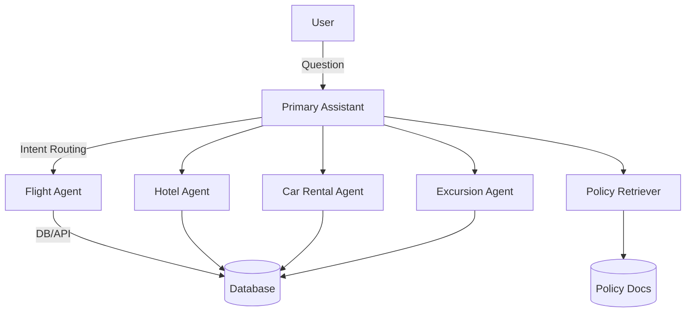

# ✈️ Travel Assistant

> **A modular, AI-powered travel assistant for booking flights, hotels, car rentals, excursions, and answering company policy questions.**

---


---

## 🚀 Key Features

- **Conversational AI**: Natural language interface for all your travel needs
- **Multi-modal Booking**: Flights, hotels, car rentals, and excursions
- **Company Policy Lookup (RAG)**: Retrieves up-to-date policy info for compliance
- **Modular & Extensible**: Clean codebase, easy to add new tools or workflows
- **User Approval**: Sensitive actions (like booking/cancelling) require confirmation
- **Terminal & VS Code Ready**: No Colab dependencies, works locally
- **Rich Error Handling**: Clear feedback and robust fallback logic

---

## 🧠 Technical Concepts

- **Conditional Interrupt**: The assistant can pause before executing sensitive actions (like bookings/cancellations) and ask the user for approval, ensuring user control over important operations.
- **Specialized Workflows**: The system routes user requests to specialized sub-agents (e.g., flight, hotel, car rental, excursion) for focused handling, improving reliability and maintainability.
- **State Management**: Uses a shared state object to track conversation history, user info, and dialog stack, enabling multi-turn, context-aware dialog.
- **Tool Routing**: Dynamically selects the right tool or workflow based on user intent, using semantic routing and intent detection.
- **Multi-turn Dialog**: Supports slot-filling and follow-up questions, allowing the assistant to gather all required information over several turns.
- **RAG (Retrieval-Augmented Generation)**: Retrieves relevant company policy text from a vector store to answer policy-related questions accurately.
- **User Approval/Interrupts**: Implements user confirmation for actions that modify bookings, using LangGraph's interrupt and checkpoint features.

---

## 🌍 What Can You Do?

- 🛫 **Book or update flights**
- 🏨 **Find and reserve hotels**
- 🚗 **Search and book car rentals**
- 🎟️ **Discover and book excursions**
- 📜 **Ask about company travel policies**
- 🗣️ **Have a multi-turn, slot-filling conversation**
- ✅ **Approve or deny sensitive actions before they're executed**

---

## 🏗️ Architecture



---

## ⚡ Quickstart

1. **Clone the repo**
2. **Create a virtual environment**
   ```sh
   python -m venv venv
   source venv/bin/activate  # On Windows: venv\Scripts\activate
   ```
3. **Install dependencies**
   ```sh
   pip install -r requirements.txt
   ```
4. **Set your API keys**
   ```sh
   set GROQ_API_KEY=your_groq_api_key
   set TAVILY_API_KEY=your_tavily_api_key
   # Or use export on macOS/Linux
   ```
5. **Run the assistant**
   ```sh
   python -m travel_assistant.main
   ```

---

## 📁 Folder Structure

```
travel_assistant/
├── main.py                # Entry point
├── config.py              # Env setup
├── database/
│   └── db_utils.py        # DB logic
├── tools/
│   ├── flights.py         # Flight tools
│   ├── hotels.py          # Hotel tools
│   ├── car_rentals.py     # Car rental tools
│   ├── excursions.py      # Excursion tools
│   └── policies.py        # Policy RAG
├── agent/
│   ├── prompts.py         # Prompts
│   ├── assistants.py      # Agent classes
│   ├── state.py           # State logic
│   └── graph.py           # Graph/routing
├── utils/
│   └── print_utils.py     # Print/error utils
├── notebooks/
│   └── customer_support.ipynb # Reference notebook
├── requirements.txt
└── README.md
```

---

## 🤝 Contributing

Pull requests, issues, and suggestions are welcome! Please open an issue or PR for any improvements or bug fixes.

---

## 🆘 Support
- For help, open an issue on GitHub or contact the maintainer.
- For API key issues, check your provider's dashboard.

---

**Happy travels! ✈️** 